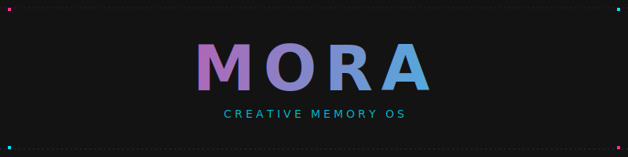

# Mora 🌌

<p align="center">
  
</p>

Mora is a local persistent memory operating system for personal content curation. It acts as an intelligence layer between fragmented digital saves and a cohesive visual archive. 🧠

## 🎨 Design Philosophy

The system utilizes a **Neon Scrapbook** and **Pixel Memory Wall** aesthetic:
* 🌑 **Surfaces**: Deep charcoal (#131313)
* 💖 **Accents**: Luminous pink (#FF2E97) and electric cyan (#00E5FF)
* 🪟 **Visuals**: Glassmorphism layers and pixel motifs
* 🧩 **Layout**: Artistic collage composition

## 📈 System Implementation Status

### ✅ Completed Phases
* 🏗️ **Phase 1: Foundation** - Migration from static UI to a dynamic React application utilizing Vite.
* 💾 **Phase 2: State Management** - Implementation of global state via React Context with localStorage persistence.
* 🖱️ **Phase 3: Core Operations** - Full CRUD functionality for content items and interactive detail views.
* 🌌 **Phase 4: Intelligence Layer** - Integration of search, type filtering, and semantic grouping through Constellations.
* 📂 **Phase 5: Portability** - Development of JSON based backup, validation, and restoration systems.
* 🛠️ **Phase 6: Normalization** - Establishment of a canonical item schema and automated normalization logic.

### ✨ Current Features
* 🖼️ **Moodboard**: Central hub for daily content interaction.
* 🕸️ **Constellations**: Semantic map for tag based content grouping.
* 🔔 **Nudge Center**: Rule based resurfacing of saved content.
* 🔍 **Capture Engine**: Logic for source and type inference from URLs.
* 🔒 **Local Persistence**: Data remains entirely on the client side.

## 📅 Future Development Roadmap

### 🚀 Immediate Objectives
* 📥 **Universal Intake**: Expansion of capture paths including browser extensions and mobile share sheets.
* 🔌 **Passive Integration**: Automated background capture from platform APIs.
* 🤖 **Refined Intelligence**: Advanced clustering algorithms for automated content categorization.

### 🔭 Long Term Vision
* 🔄 **Cross Platform Sync**: Secure, end to end encrypted synchronization between devices.
* 🔎 **Deep Search**: Full text indexing and semantic search capabilities.
* 🌐 **Offline First Architecture**: Robust support for disconnected environments with conflict resolution.

## ⚙️ Technical Architecture

### 💻 Tech Stack
* **Framework**: React 18+ via Vite
* **Routing**: React Router
* **Styling**: Tailwind CSS
* **Typography**: Space Grotesk and Inter
* **Icons**: Material Symbols (Rounded)

### 📊 Data Schema
All content items are normalized to the following structure:

| Field | Type | Description |
| :--- | :--- | :--- |
| `id` | String | Unique internal identifier |
| `title` | String | Human readable label |
| `url` | String | Source URL |
| `source` | String | Normalized source (e.g., youtube, spotify) |
| `type` | String | Content category |
| `tags` | Array | Semantic labels |
| `metadata` | Object | Supplemental data |
| `raw` | Object | Original input object |

## 🚀 Local Development

1. **Install dependencies**:
   ```bash
   npm install
   ```
2. **Start development server**:
   ```bash
   npm run dev
   ```
3. **Build for production**:
   ```bash
   npm run build
   ```
